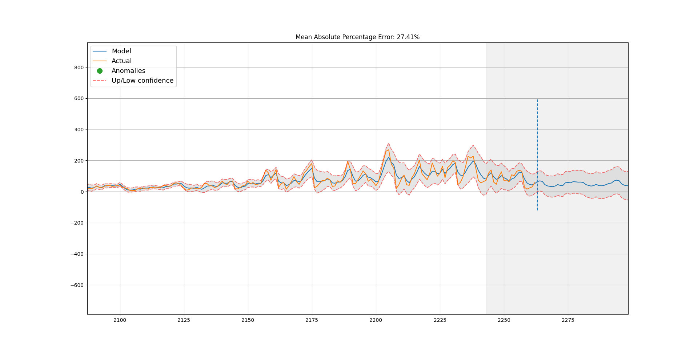
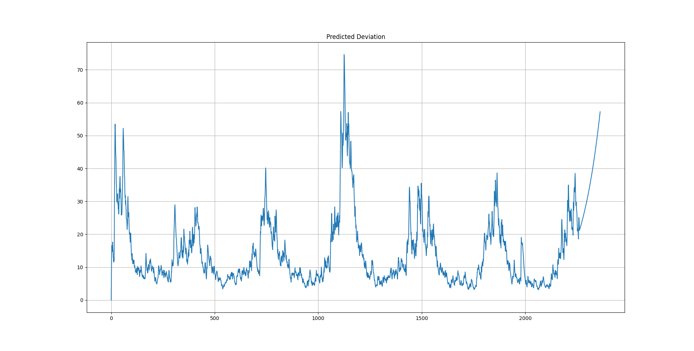

# Holt-winters Additive Model(HWAAS)三次指数平滑法
使用Holt-winters Additive Model对西安市PM2.5数据集进行预测

共2716条数据

训练集数据：2263

测试集数据：453

MAPE：27.41%

<pre><code>
python  time_series.py	
</pre></code>
<table> <tbody> <tr> <td align="left" width=450>
Mean Absolute Percentage Error 
</a></td>
<td align="left" width=450>
Predicted Deviation 
</a></td>
</td></tr></tbody></table>

